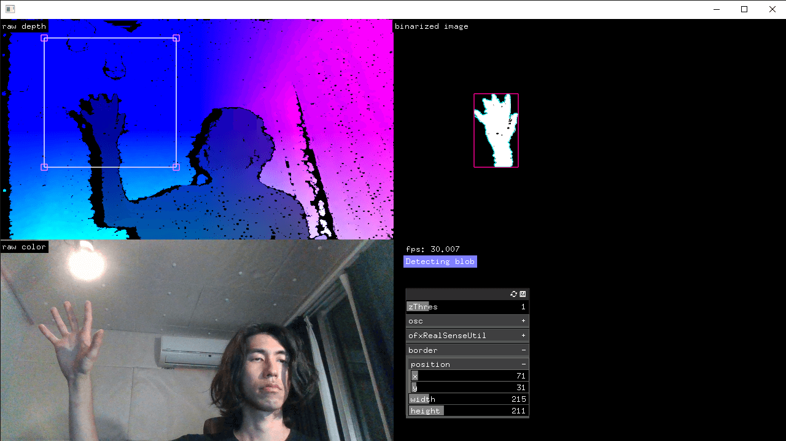
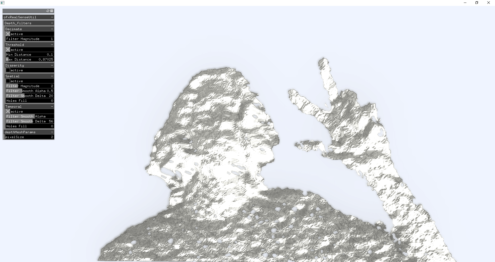

# ofxRealSenseUtil
Wrapper and Utilities for RealSense SDK

## Screenshots

Blob detection (in screen space with a depth threshold)

Polygon-meshing

## Dependency
* IntelRealSense / [librealsense](https://github.com/IntelRealSense/librealsense)
  * Using the installer (Intel.RealSense.SDK.exe) is recommended

## Feature
* Polygon (triangulated geometry) creation with texture
* Data creation *in a separated thread*
* Record to / playback from `.bag` files

## TODO
* Mac compatibility (But [this addon](https://github.com/hiroMTB/ofxRealsense2) seems very nice for mac)
